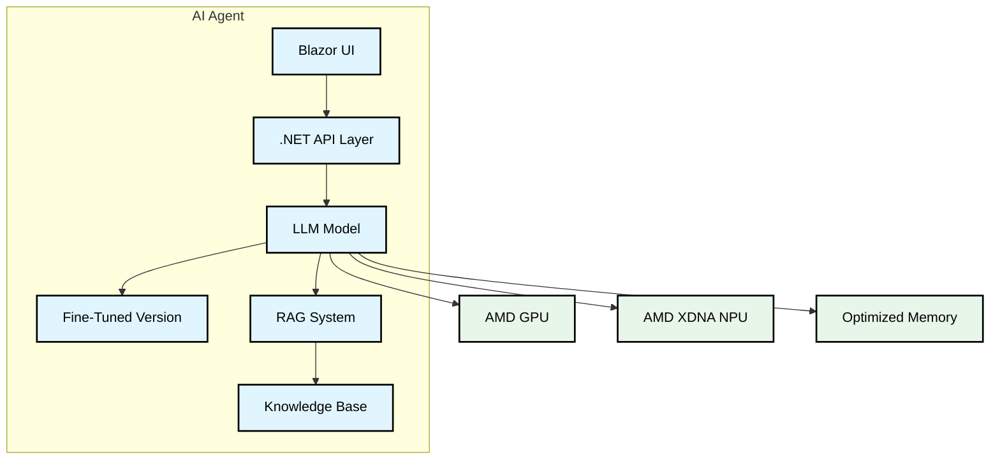

# AI Agent Strategy for Smart Portfolio Advisor

## Overview
This document explores AI agent approaches for the Smart Portfolio Advisor, focusing on self-hosted models optimized for Ryzen AI processors with GPUs and NPUs, and leveraging .NET ecosystem capabilities.

## Hardware Considerations

### Ryzen AI Architecture
- **Processors**: AMD Ryzen with AI cores
- **GPUs**: AMD Radeon GPUs
- **NPUs**: AMD XDNA Neural Processing Units
- **Memory**: Optimized for large model inference
- **Storage**: NVMe for model caching

### Kubernetes Integration
- GPU/NPU resource scheduling
- Model containerization
- Resource allocation optimization
- Load balancing for inference

## AI Model Options

### 1. Self-Hosted LLM Options
- **BLOOM**
  - Open-source, large model
  - Good for financial domain
  - Optimized for AMD hardware
  - .NET integration available

- **Mistral**
  - Efficient architecture
  - Strong financial understanding
  - AMD GPU optimized
  - .NET bindings available

- **Llama 2**
  - Open-source, well-supported
  - Strong financial domain
  - AMD GPU optimizations
  - .NET integration

### 2. .NET Integration Options
- **DeepSeek.NET**
  - Native .NET implementation
  - Optimized for AMD hardware
  - Financial domain expertise
  - Easy Kubernetes deployment

- **FastLLM.NET**
  - .NET native inference
  - AMD GPU support
  - Low latency
  - Container-friendly

## Agent Architecture

### 1. Core Components
- **Model Layer**
  - Primary LLM (e.g., Mistral)
  - Financial domain fine-tuning
  - RAG integration
  - AMD hardware acceleration

- **Knowledge Base**
  - Financial documents
  - Market data
  - Portfolio analysis
  - Economic indicators

- **.NET Integration**
  - REST API endpoints
  - gRPC services
  - WebSocket connections
  - Blazor UI components

### 2. RAG Implementation
- **Vector Database**
  - Milvus/Zilliz
  - Qdrant
  - FAISS
  - .NET native integration

- **Document Processing**
  - PDF parsing
  - Excel processing
  - Web scraping
  - Data normalization

### 3. Fine-Tuning Strategy
- **Base Model Training**
  - Financial domain
  - Portfolio analysis
  - Risk assessment
  - Market understanding

- **Custom Data Sets**
  - Analyst reports
  - Financial news
  - SEC filings
  - Market data

## Architecture Diagram

## Implementation Strategy

### 1. Development Environment
- **Local Development**
  - .NET SDK
  - ML.NET
  - Docker Desktop
  - Kubernetes

- **AMD GPU/NPU Support**
  - ROCm integration
  - OpenCL support
  - DirectML acceleration

### 2. Kubernetes Deployment
- **Container Structure**
  - Model container
  - API container
  - RAG container
  - Frontend container

- **Resource Optimization**
  - GPU/NPU allocation
  - Memory management
  - Load balancing
  - Auto-scaling

### 3. Model Management
- **Version Control**
  - Model versions
  - Fine-tuning iterations
  - RAG updates
  - Performance metrics

- **Monitoring**
  - Resource usage
  - Response times
  - Accuracy metrics
  - User feedback

## Performance Considerations

### 1. AMD Hardware Optimization
- **GPU/NPU Utilization**
  - Model parallelism
  - Batch processing
  - Memory optimization
  - Cache management

- **Memory Management**
  - Model quantization
  - Layer caching
  - Lazy loading
  - Memory pooling

### 2. .NET Performance
- **Async Processing**
  - Parallel inference
  - Pipeline processing
  - Batch operations

- **Memory Management**
  - Object pooling
  - Memory recycling
  - Large object handling

## Security Considerations

### 1. Data Security
- **Model Protection**
  - Model encryption
  - Secure loading
  - Access control

- **Data Handling**
  - Secure storage
  - Encryption in transit
  - Access logging
  - Audit trails

## Development Roadmap

### Phase 1: Infrastructure Setup
1. Kubernetes cluster configuration
2. AMD GPU/NPU setup
3. .NET development environment
4. Model containerization

### Phase 2: Core Agent Development
1. Model selection and deployment
2. RAG implementation
3. Fine-tuning pipeline
4. API development

### Phase 3: Integration
1. Frontend integration
2. Portfolio analysis
3. Risk assessment
4. Performance optimization

### Phase 4: Optimization
1. Hardware optimization
2. Memory management
3. Load testing
4. Performance tuning

## Technical Stack

### 1. Core Technologies
- **.NET Framework**
  - .NET 8.0+
  - ML.NET
  - FastLLM.NET
  - DeepSeek.NET

- **Kubernetes**
  - Container orchestration
  - Resource management
  - Load balancing
  - Auto-scaling

- **AMD Hardware**
  - ROCm
  - OpenCL
  - DirectML
  - GPU/NPU drivers

### 2. Development Tools
- **IDE**: Visual Studio
- **Build**: .NET SDK
- **Container**: Docker
- **CI/CD**: GitHub Actions
- **Monitoring**: Prometheus

## Next Steps
1. Set up development environment
2. Select initial model
3. Implement RAG prototype
4. Create fine-tuning pipeline
5. Develop API layer
6. Begin performance testing
